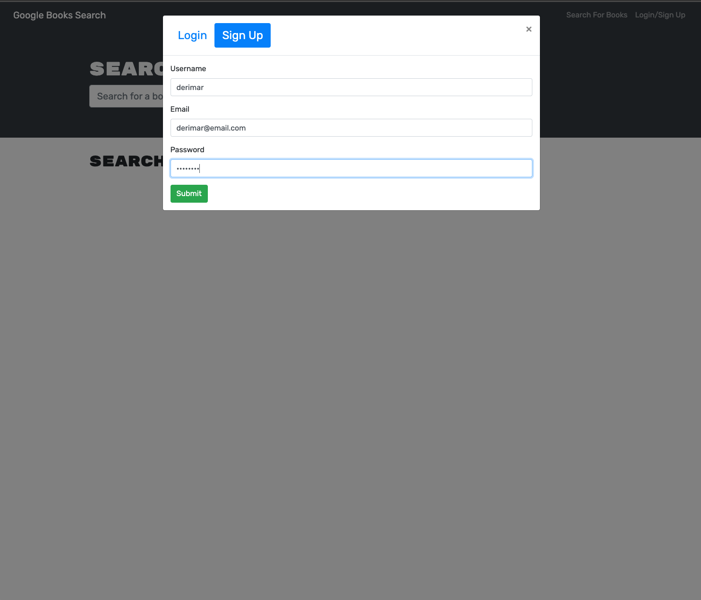
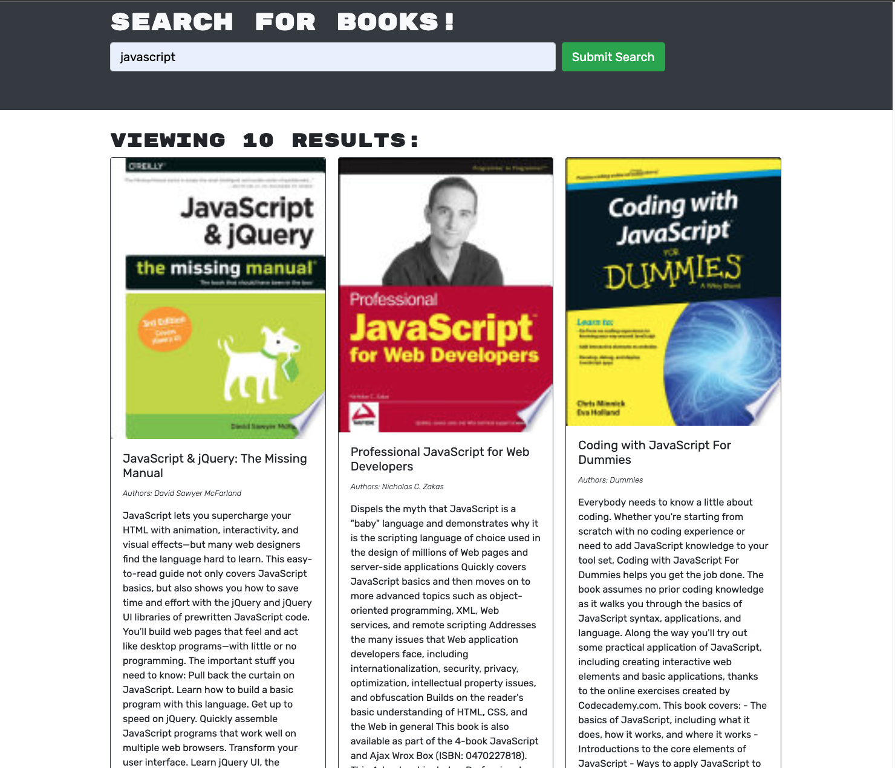

![Repo Size][repo-size]
![Language][github-language]
[![Contributors][contributors-shield]][contributors-url]
[![Forks][forks-shield]][forks-url]
[![Stargazers][stars-shield]][stars-url]
[![Issues][issues-shield]][issues-url]
[![LinkedIn][linkedin-shield]][linkedin-url]
![MIT License][license-shield]

<br />
<p align="center">

<h3 align="center" id="book-search-engine">Book Search Engine</h3>

<p align="center">
As an avid reader, I want to search for new books to read so that I can keep a list of books to purchase.
<br />
<a href="#how-to-download"><strong>Explore the docs »</strong></a>
<br />
<br />
<a href="#example">View Demo</a>
.

·
<a href="https://github.com/Derimarg/book-search-engine/issues">Request Feature</a>
</p>
</p>
<br />
<br />

> Link web page: https://dg-book-search-engine.herokuapp.com/

<details open="open">
<summary>Table of Contents</summary>
<ul>
<li><a href="#description">Description</a></li>
<li><a href="#technologies">Technologies</a></li>
<li><a href="#how-to-download">Download</a></li>
<li><a href="#installation">Installation</a></li>
<li><a href="#prerequisites">Prerequisites</a></li>
<li><a href="#usage">Usage</a></li>
<li><a href="#roadmap">Roadmap</a></li>
<li><a href="#contributing">Contributing</a></li>
<li><a href="#questions">Questions</a></li>
<li><a href="#license">License</a></li>
</ul>
</details>

---

## Description

GIVEN a book search engine

- Loading the search engine, I will presented with a menu with the options Search for Books and Login/Signup and an input field to search for books and a submit button.

- Clicking on the Search for Books menu option, I will presented with an input field to search for books and a submit button.

- If I am not logged in and enter a search term in the input field and click the submit button, I will be presented with several search results, each featuring a book’s title, author, description, image, and a link to that book on the Google Books site.

- Clicking on the Login/Signup menu option,a modal will appear on the screen with a toggle between the option to log in or sign up.

- If the toggle is set to Signup, I am presented with three inputs for a username, an email address, and a password, and a signup button.

- If the toggle is set to Login, I am presented with two inputs for an email address and a password and login button.

- Entering a valid email address and create a password and click on the signup button, my user account will be created and I am logged in to the site.

- Entering my account’s email address and password and click on the login button, the modal closes and I am logged in to the site.

- If I am logged in to the site, the menu options change to Search for Books, an option to see my saved books, and Logout.

- Being logged in and enter a search term in the input field and click the submit button, I am presented with several search results, each featuring a book’s title, author, description, image, and a link to that book on the Google Books site and a button to save a book to my account.

- Clicking on the Save button on a book, that book’s information is saved to my account.

- Clicking on the option to see my saved books, I am presented with all of the books I have saved to my account, each featuring the book’s title, author, description, image, and a link to that book on the Google Books site and a button to remove a book from my account.

- Clicking on the Remove button on a book, that book will be deleted from my saved books list.

- Clicking on the Logout button, I am logged out of the site and presented with a menu with the options Search for Books and Login/Signup and an input field to search for books and a submit button.

<br />
<br />
<br/>

## Example

<br />
<br />


<br />
<br />

<br />
<br />

<br />
<br />

<br />
<br />
<br />
<br />

## Technologies

- <p><a href="https://nodejs.org/">Node.js</a></p>
- <p><a href="https://getbootstrap.com/">Bootstrap</a></p>
- <p><a href="https://www.npmjs.com/">NPM</a></p>
- <p><a href="https://reactjs.org/docs/getting-started.html">React</a></p>
- <p><a href="https://www.npmjs.com/package/graphql">NPM GrapghQL</a></p>
- <p><a href="apollographql.com/docs/react/get-started/">NPM Apollo Clinet</a></p>
- <p><a href="https://www.npmjs.com/package/apollo-server-express">NPM Apollo Server Express</a></p>
- <p><a href="https://www.npmjs.com/package/react-router">NPM React Router</a></p>
- <p><a href="https://www.npmjs.com/package/react-router-dom">NPM React Router DOM</a></p>
- <p><a href="https://www.npmjs.com/package/concurrently">NPM Concurrently</a></p>
- <p><a href="https://www.npmjs.com/package/jsonwebtoken">NPM JSON Web Tokens</a></p>
- <p><a href="https://www.npmjs.com/package/jwt-decode">NPM JWT Decode</a></p>
- <p><a href="https://www.npmjs.com/package/nodemon">NPM Nodemon</a></p>
- <p><a href="https://www.npmjs.com/package/if-env">NPM If Env</a></p>
- <p><a href="https://www.mongodb.com/">MongoDB</a></p>
- <p><a href="https://www.heroku.com/">Heroku</a></p>

[Back To Top](#book-search-engine)

---

## How to Download

- Simply copy the **SSH** to the terminal or Download the **ZIP File**:

## Installation

- Use the follow command at your terminal, **git clone** (Create a working copy at your local repository):

  ```
  git clone git@github.com:Derimarg/book-search-engine.git
  ```

- After cloned the repository, create your own repository, copy the files to your repository and type in your terminal the follow commands.

  ```
  git status

  git add -A

  git commit -m "Message to commit."

  git push or git push origin main
  ```

## Prerequisites

Before of using this application, is require to install dependencies, run the following command in your terminal:

```
npm install
```

[Back To Top](#book-search-engine)

---

## Usage

This is a open source program, feel free to use it, contact me to request features.

```javascript
 "scripts": {
    "start": "if-env NODE_ENV=production && npm run start:prod || npm run start:dev",
    "start:prod": "cd server && npm start",
    "start:dev": "concurrently \"cd server && npm run watch\" \"cd client && npm start\"",
    "install": "cd server && npm i && cd ../client && npm i",
    "heroku-postbuild": "cd client && npm run build"
  }
```

### `npm run start:dev`

Runs the app in the development mode.\
Open [http://localhost:3000](http://localhost:3000) to view it in the browser.

The page will reload if you make edits.\
You will also see any lint errors in the console.

### `git push heroku main`

Will deploy app to heroku

<!-- ROADMAP -->

## Roadmap

See the [open issues](https://github.com/Derimarg/book-search-engine/issues) for a list of proposed features (and known issues).

[Back To Top](#book-search-engine)

---

<!-- CONTRIBUTORS -->

## Contributing


1. Fork the Project
2. Create your Feature Branch (`git checkout -b feature/name-of-feature`)
3. Commit your Changes (`git commit -m "Add some feature"`)
4. Push to the Branch (`git push origin feature/name-of-feature`)
5. Open a Pull Request

## Questions

